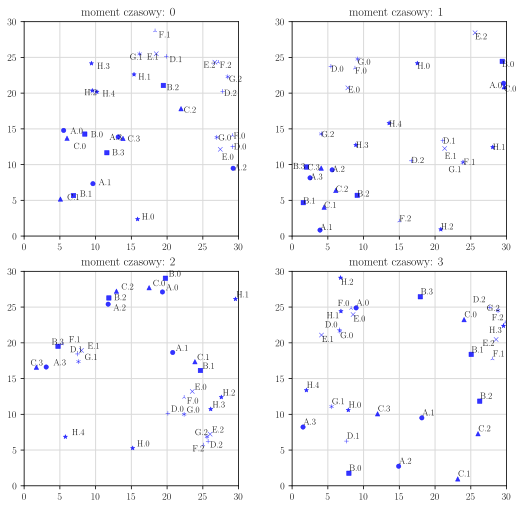
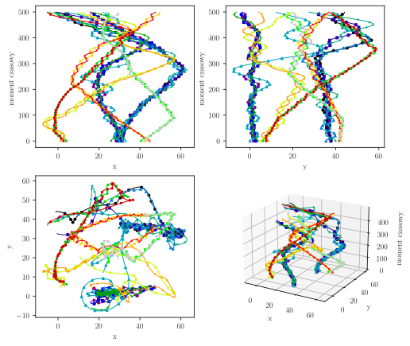
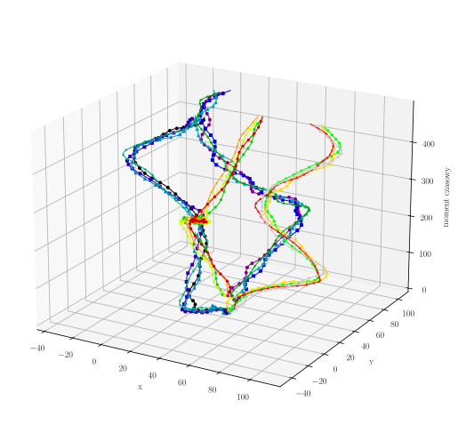
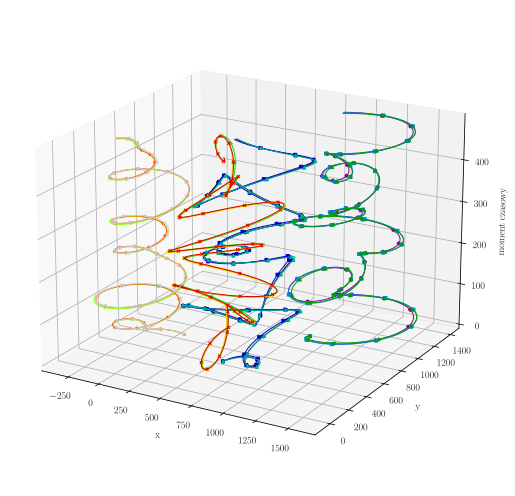
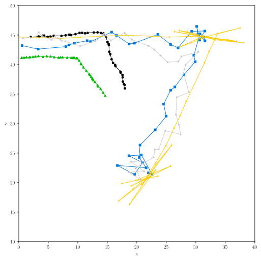

# moving-objects-data-generator

## Parameterized moving objects data generator for spatial data analysis
This repository is created because of working on Master Thesis. There will be placed any of the scripts, programs, codes, data, analyses and results in order to complete the research.

## Usage
The implemented synthetic dataset generators are available in [`moving-objects-data-generator/algorithms/generator/`](https://github.com/tomdziwood/moving-objects-data-generator/tree/master/moving-objects-data-generator/algorithms/generator) directory. Each of the python file contains `if __name__ == "__main__"` code block, which shows how to generate dataset with given generator model.

## License
This project is licensed under the Apache License, Version 2.0 - 
see the [LICENSE](https://github.com/tomdziwood/moving-objects-data-generator/blob/master/LICENSE) file for details.

## Acknowledgements
The project is created with [Python 3.9.12](https://www.python.org/) programming language. The developed code works thanks to the some crucial libraries:
- [numpy 1.22.3](https://numpy.org/) - core computing package which helps to achieve fast scripts execution with usage of vectorized operations,
- [matplotlib 3.5.1](https://matplotlib.org/) - library for creating any of the charts, visualizations and animated movement of objects with .gif format,
- [pandas 1.4.2](https://pandas.pydata.org/) - flexible tool for data manipulation,
- [adjustText 0.7.3](https://github.com/Phlya/adjustText) - automatic label placement for matplotlib library.

## Visualization of generated datasets
### SpatioTemporalStandardGenerator

### SpatioTemporalInteractionApproachGenerator

### SpatioTemporalOptimalDistanceApproachGenerator

### SpatioTemporalCircularMotionApproachGenerator

### SpatioTemporalTravelApproachGenerator

